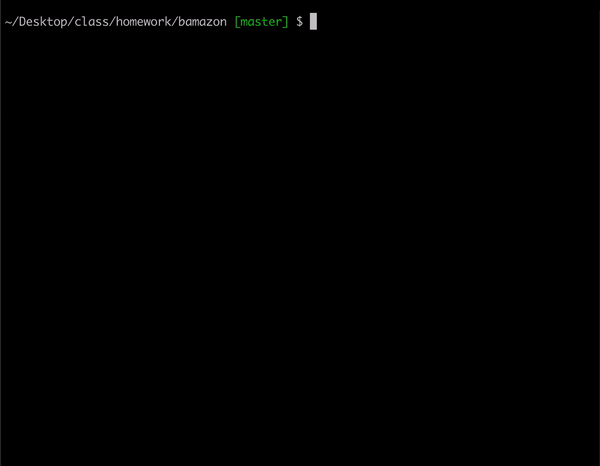

# bamazon

bamazon is a command line nodeJS app created to keep track of store inventory from the customer, manager and supervisor views.
## Description
For the customer, bamazon will display the items for sale and the prices for each item. The customer can then type in the id number for the item they wish to purchase. The app will ask how many items the customer wants to purchase and calculate their total. The inventory will be updated based on the purchase.

For the manager, bamazon will give the user a menu with the options to view all products, add a new product, add stock to a product carried and show low inventory. 

--The supervisor app is not fully functional at this time--
For the supervisor, bamazon will allow the user to create a new department. The user can also review the product sales by department and see profits for departments.

## How to use

**`node bamazonCustomer.js`**
This will run the bamazon customer app. When run the store inventory will display. From the inventory table, the user will select the item they wish to purchase and type the id number. The user will then be prompted to enter the number of items they want. If they want more than is in stock, the app will inform them. If the quantity is available, the app will calculate the user's total.

**`node bamazonManager.js`**
This will run the bamazon manager app. When run, a menu will give the user a list of options.

* View Products for Sale
    Will show all products for sale. Output will display the item id, product name, price, number in stock
* View Low Inventory
    Will show all items that have a stock quantity of 5 or lower
* Add to Inventory
    Will allow the user to enter an item id and add to the inventory
* Add New Product
    Will allow the user to add a new product to inventory

**`node bamazonSupervisor.js`**
This will run the bamazon supervisor app. When run, a menu will give the user two options. 

* View Product Sales by Department
    Will show profits from products and total profit from each department
* Create a New Department
    Will allow the user to add a new department

## Tech used

- Visual Studios
- JavaScript
- Node.js
- MySQL

## Role in App Development
Created by one developer